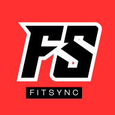

<div align="center">
  <br />
    
  <h1 align="center">FitSync - Gym Management System</h1>
</div>

<p align="center">
  
  
  
  
  
</p>

FitSync is a comprehensive, all-in-one management solution designed for modern fitness centers. It provides a suite of tools for administrators, receptionists, instructors, and members to streamline operations, enhance member engagement, and manage all aspects of a gym's day-to-day activities.

The application is built as a multi-dashboard system, providing tailored experiences for different user roles.

---

## Recent Updates (v1.1.0)

-   **feat(analytics):** Added "Revenue Breakdown" and "Expense Breakdown" charts to the admin analytics dashboard for deeper financial insights.
-   **feat(dashboard):** Integrated a "Recent Transactions" table on the main admin dashboard, showing a unified view of both membership payments and walk-in sales.
-   **feat(pos):** Implemented a search bar in the reception Point-of-Sale (POS) system for faster product and service lookup.
-   **feat(check-in):** Added check-in history tracking for members on their profile and check-in pages. A status badge now indicates if a member is currently checked-in.
-   **feat(inventory):** Enabled inline editing and deletion of items directly from the inventory details page.
-   **fix(routing):** Corrected a routing bug where reception staff were incorrectly redirected to an admin page. They now have a dedicated read-only view.
-   **style(ui):** Implemented a custom, thin, branded scrollbar across the admin dashboard for a more polished and cohesive look.

## Key Features

-   **Multi-Role Dashboards**: Separate, feature-rich dashboards for Admins, Members, Receptionists, and Instructors.
-   **Member Management**: Track member details, status, and plans. Approve new sign-ups.
-   **Class Scheduling**: A smart, interactive calendar to schedule, manage, and block off classes, including support for recurring events.
-   **Financial Tracking**: Monitor payments, view transaction histories, and see revenue analytics.
-   **Walk-in & POS System**: A point-of-sale interface for receptionists to handle walk-in services and payments.
-   **Member Self-Service**: Members can book classes, log workouts and meals, view their QR code for check-in, and manage their billing.
-   **Real-time Analytics**: Visual charts for tracking membership growth, income, class occupancy, and peak gym hours.
-   **Inventory & Service Management**: Admins can manage gym inventory and walk-in services offered.

---

## Project Scope

The modules covered in the system include:

### 1. Admin Module
Grants administrators full access to manage the entire gym operation.
-   **Dashboard:** Displays an at-a-glance overview of key metrics like total members, active members, revenue, and trainers on duty, with a feed of recent transactions.
-   **Member Management:** Allows admins to view, add, edit, and manage all member profiles across different locations.
-   **Trainer Management:** Enables management of trainer profiles, specializations, and assignments.
-   **Staff Management:** Provides tools to add, edit, and manage non-trainer staff roles and access.
-   **Schedule Management:** A comprehensive calendar interface to create, view, update, and delete classes. Supports recurring events and blocking off specific dates.
-   **Payment Management:** Tracks all member payments and provides a detailed view of each transaction.
-   **Plan Management:** Allows creation and management of different membership plan structures (e.g., Basic, Premium, VIP).
-   **Services Management:** Enables admins to define and manage walk-in services available at the reception POS.
-   **Inventory Management:** Provides tools to track, add, edit, and delete gym inventory, from equipment to products for sale.
-   **Walk-in Sales:** A dedicated view for admins to monitor all POS transactions from reception.
-   **Account Approval:** A queue for reviewing and approving or rejecting pending member sign-ups.
-   **Analytics:** Offers in-depth visual analytics with charts for membership growth, income, expenses, class occupancy, check-in history, and peak hours.
-   **Location Management:** Manages different gym branches and their specific details.

### 2. Member Module
A mobile-first dashboard for members to manage their gym experience.
-   **Dashboard:** A personalized home screen showing upcoming classes and weekly workout goals.
-   **Class Booking:** Allows members to browse and book available classes.
-   **Check-In System:** Displays a personal QR code for quick check-in at the reception and shows current check-in status and history.
-   **Messaging:** A direct messaging interface to communicate with assigned trainers.
-   **Profile & Progress:** A central hub to view personal stats, activity history, and workout progress.
-   **Billing Management:** Enables members to view payment history, manage payment methods, and see current plan details.
-   **Workout & Meal Logging:** Provides a quick-log feature for members to track their workouts and meals.

### 3. Reception Module
A streamlined dashboard for front-desk staff to manage daily operations.
-   **Check-In:** A primary interface to search for members by name/ID or use a QR scanner to check them in.
-   **Point-of-Sale (POS):** An interface to process payments for walk-in customers and non-member services (e.g., day passes, product sales).
-   **Transaction History:** A view to see all walk-in transactions processed at that specific reception desk.
-   **Schedule View:** A read-only view of the day's class schedule.

### 4. Instructor Module
A dedicated space for trainers to manage their classes and clients.
-   **Dashboard:** An overview of the instructor's daily schedule and total assigned clients.
-   **Schedule Management:** A personal calendar showing only the classes assigned to that instructor.
-   **Client Management:** A list of assigned members, with access to their profiles to create and send custom workout/meal plans and view progress.
-   **Messaging:** A dedicated interface to communicate with clients.

### 5. Core System Modules
-   **Authentication:** Handles secure login for different user roles (Admin, Member, Instructor, Reception).
-   **Notifications:** Delivers role-specific, real-time notifications for events like new sign-ups, payment failures, or full classes.
-   **Settings:** Provides a dedicated area for each user role to manage their profile, password, and other preferences.
-   **Help & Support:** A framework for providing help, support, and feedback pages within each user dashboard.

---

## Tech Stack

-   **Framework**: [Next.js](https://nextjs.org/) (App Router)
-   **Language**: [TypeScript](https://www.typescriptlang.org/)
-   **Styling**: [Tailwind CSS](https://tailwindcss.com/)
-   **UI Components**: [Shadcn UI](https://ui.shadcn.com/)
-   **Charts**: [Recharts](https://recharts.org/)
-   **Icons**: [Lucide React](https://lucide.dev/)
-   **State Management**: React Context & `useState`
-   **Linting & Formatting**: ESLint

---

## Getting Started

### Prerequisites

-   Node.js (v18 or later)
-   npm or yarn

### Installation

1.  **Clone the repository:**
    ```bash
    git clone <repository-url>
    cd fitsync-project
    ```

2.  **Install dependencies:**
    ```bash
    npm install
    ```
    or
    ```bash
    yarn install
    ```

### Running the Development Server

To run the application in development mode, execute the following command:

```bash
npm run dev
```

The application will be available at [http://localhost:9002](http://localhost:9002).

---

## Deployment & Setup Strategies

This section provides guidance for deploying FitSync in different environments.

### Strategy 1: On-Premise Setup (Local Network Access)

This setup is ideal for gyms that want to host the staff-facing dashboards (Reception, Instructor) on a local server, accessible only from within the gym's Wi-Fi network.

**Use Case:** A receptionist at the front desk or an instructor on the gym floor accesses their dashboard from a tablet or computer connected to the gym's private network.

#### On-Premise Setup Steps:

1.  **Prepare a Server:**
    -   Designate a reliable computer or a small server (e.g., an Intel NUC or similar) that will run 24/7 on the gym's local network.
    -   Install **Node.js (v18 or later)** on this machine.
    -   Ensure this server has a **static IP address** on the local network (e.g., `192.168.1.100`) so its address doesn't change.

2.  **Build the Application for Production:**
    -   On the server machine, navigate to the project directory.
    -   Run the build command:
        ```bash
        npm run build
        ```
        This creates an optimized production version of the application.

3.  **Run the Production Server:**
    -   Start the application using the following command, specifying the port you want it to run on (e.g., port 3000).
        ```bash
        npm start -- -p 3000
        ```

4.  **Accessing the Dashboards:**
    -   Staff members can now access the application by opening a web browser on any device connected to the gym's Wi-Fi and navigating to the server's local IP address and port.
    -   **Example URLs:**
        -   **Reception:** `http://192.168.1.100:3000/login/reception`
        -   **Instructor:** `http://192.168.1.100:3000/login/instructor`
    -   For easy access, you can create shortcuts or browser bookmarks on staff devices.

5.  **Geofencing Note:**
    -   This setup achieves a basic form of "geofencing" because the application is only accessible to devices connected to the gym's internal network. No one outside the gym's Wi-Fi can reach it.

### Strategy 2: Multi-Domain Deployment for Security

This advanced strategy provides maximum security and separation of concerns by deploying each user-facing application to its own unique subdomain.

**Use Case:** A large fitness chain wants to ensure that member data, admin functions, and staff tools are completely isolated from each other.

**Example Domain Structure:**
-   **Member Dashboard:** `app.fitsync.com`
-   **Admin Dashboard:** `admin.fitsync.com`
-   **Reception & Instructor Dashboards:** `staff.fitsync.com`

This architecture requires a hosting provider that supports custom domains and environment variables (like Vercel, Netlify, or AWS Amplify). The core idea is to use **Next.js Rewrites** and middleware to route traffic based on the hostname.

#### Multi-Domain Setup Steps (Example with Vercel):

1.  **Configure Custom Domains:**
    -   In your hosting provider (e.g., Vercel), add your custom domains/subdomains to the project.
        -   `app.fitsync.com`
        -   `admin.fitsync.com`
        -   `staff.fitsync.com`
        -   `fitsync.com` (for the main landing page)

2.  **Update Next.js Config for Routing:**
    -   Modify your `next.config.ts` to implement rewrite rules based on the hostname. This tells Next.js which part of your application to serve for each domain.

    ```ts
    // next.config.ts

    import type { NextConfig } from 'next';

    const nextConfig: NextConfig = {
      // ... other configs
      async rewrites() {
        return [
          // Main Landing Page
          {
            source: '/:path*',
            destination: '/:path*',
            has: [{ type: 'host', value: 'www.fitsync.com|fitsync.com' }],
          },
          // Member App
          {
            source: '/:path*',
            destination: '/member/:path*',
            has: [{ type: 'host', value: 'app.fitsync.com' }],
          },
          // Admin App
          {
            source: '/:path*',
            destination: '/admin/:path*',
            has: [{ type: 'host', value: 'admin.fitsync.com' }],
          },
           // Staff App (Reception & Instructor)
          {
            source: '/reception/:path*',
            destination: '/reception/:path*',
            has: [{ type: 'host', value: 'staff.fitsync.com' }],
          },
          {
            source: '/instructor/:path*',
            destination: '/instructor/:path*',
            has: [{ type: 'host', value: 'staff.fitsync.com' }],
          },
           // Route the login pages for staff
          {
            source: '/:path*',
            destination: '/login/:path*',
            has: [{ type: 'host', value: 'staff.fitsync.com' }],
          },
        ];
      },
    };

    export default nextConfig;
    ```

3.  **Deployment:**
    -   Deploy your application. The hosting provider, combined with the Next.js config, will now handle the routing automatically.
    -   When a user visits `admin.fitsync.com`, Next.js will serve the content from the `/src/app/admin` directory, effectively isolating it from the other dashboards.

---

## Project Structure

The project follows the standard Next.js App Router structure.

-   **/src/app/**: Contains all the routes and pages for the application.
    -   **/admin/**: Admin dashboard routes.
    -   **/member/**: Member dashboard routes.
    -   **/reception/**: Reception dashboard routes.
    -   **/instructor/**: Instructor dashboard routes.
    -   **/login/**: All authentication-related pages.
-   **/src/components/**: Shared React components.
    -   **/ui/**: Core UI components from Shadcn UI.
    -   **/analytics/**: Chart components for the analytics page.
-   **/src/lib/**: Contains utility functions, data types, and mock data.
-   **/src/context/**: React context providers for shared state.
-   **/public/**: Static assets.
-   **tailwind.config.ts**: Configuration for Tailwind CSS.
-   **next.config.ts**: Configuration for Next.js.
```